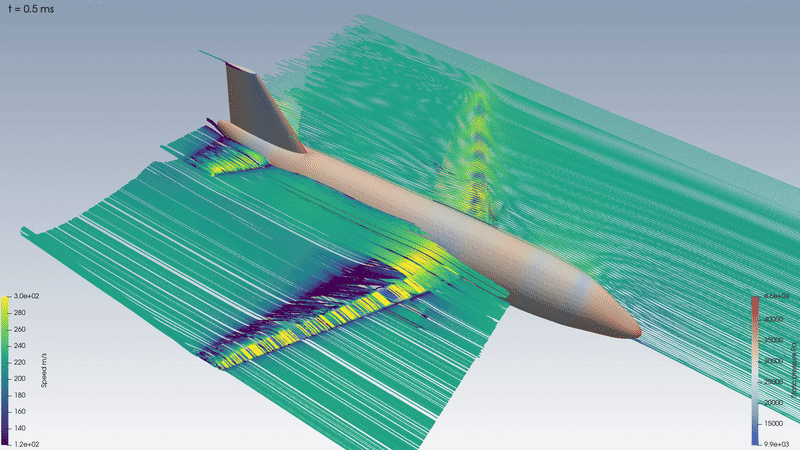

# Boeing 737-200 Wing Aerodynamic Redesign Study



[](https://github.com/Thor2709/Boeing-737-200-Unofficial-CFD-Simulations-Multiple-Wing-Designs/actions/workflows/tests.yml)

An aerodynamic redesign and computational evaluation of the Boeing 737-200 wing under transonic cruise ($M = 0.74$, 30,000 ft) and take-off conditions.
The investigation benchmarks five wing configurations using flow5 3D panel methods and Ansys Fluent half-aircraft RANS and scale-resolving SBES simulations.
Automated pipelines integrate OpenVSP parametric geometry, Fluent Meshing poly-hexcore generation under the 1M Student cell limit, and ParaView post-processing.

## Highlights
- **Transonic Efficiency Gains**: Optimized aerofoil with linear twist (C4) achieved $L/D = 11.32$ and 2,473 nmi range, an 11% improvement (+244 nmi) over baseline C5 ($L/D = 10.19$, 2,229 nmi).
- **High-Lift Flap Ceiling**: Configuration C3 demonstrated that a plain flap reaches $C_{L,\max} \approx 1.085$ at $\alpha = 9^\circ$, demonstrating why multi-element slotted flaps are required for the 1.675 take-off target.
- **GPU vs CPU Transonic Sensitivity**: Identified a +10.6% $C_L$ divergence between GPU pressure-based and CPU density-based solvers caused by shock-induced separation differences.
- **Student Cell Limit Budgeting**: Successfully meshed and converged full half-aircraft configurations at ~980k poly-hexcore cells within the 1M Ansys Student cell limit.
- **Scale-Resolving SBES Physics**: Executed 0.3 s of transient Stress-Blended Eddy Simulation (SBES) on GPU capturing unsteady wing-wake and pylon interaction structures.

## Results Summary

### CFD RANS Results ($M = 0.74$, 30,000 ft, Target $C_L = 0.4895$)
| Case | Description | α° | $C_L$ | $C_D$ | $L/D$ | Range (nmi) |
|---|---|---|---|---|---|---|
| **C1** | NACA 0012, twist +1° | 5.187 | 0.4874 | 0.05937 | 8.21 | 1798 |
| **C2** | Optimised aerofoil AOPT | 2.522 | 0.4901 | 0.04361 | 11.24 | 2453 |
| **C4** | AOPT, linear twist ±0.459° | 3.339 | 0.4896 | 0.04325 | 11.32 | 2473 |
| **C5** | Real B737-200 sections | 3.624 | 0.4882 | 0.04791 | 10.19 | 2229 |

*C3 take-off ($M = 0.218$, sea level): $C_{L,\max} \approx 1.085$ at α = 9°; the 1.675 target is unreachable with a plain flap.*

### flow5 Panel Method Results
| Case | Description | α° | $C_D$ | $L/D$ | $e$ |
|---|---|---|---|---|---|
| **F1** | NACA 0012, twist +1° | 4.582 | 0.01495 | 32.7 | 0.978 |
| **F2** | Optimised aerofoil AOPT | 1.875 | 0.01541 | 31.8 | 0.973 |
| **F3** | AOPT + plain flap (take-off, $C_L = 1.675$) | 7.633 | 0.2173 | 7.7 | 0.771 |
| **F4** | AOPT, linear twist ±0.459° | 3.009 | 0.01547 | 31.6 | 0.965 |
| **F5** | Real B737-200 sections | 3.804 | 0.01518 | 32.2 | 0.965 |

**Best Configuration**: Configuration **C4** yielded the highest aerodynamic efficiency ($L/D = 11.32$, range 2,473 nmi), cutting drag to $C_D = 0.04325$. The linear twist ($\pm0.459^\circ$) optimized spanwise loading, outperforming baseline C5 by +244 nmi and C1 by +675 nmi.

## Figure Gallery
<table>
<tr>
<td width="50%"><br><b>Figure 1:</b> Transient scale-resolving SBES eddy simulation (0.3 s) capturing transonic wing wake and pylon vortex structures.</td>
<td width="50%"><br><b>Figure 2:</b> Parametric OpenVSP half-aircraft model comprising wing, fuselage, nacelle, and empennage.</td>
</tr>
<tr>
<td width="50%"><br><b>Figure 3:</b> Fluent Meshing poly-hexcore boundary layer mesh (~980k cells) constrained to the Student 1M cell ceiling.</td>
<td width="50%"><br><b>Figure 4:</b> flow5 wing-alone polar comparison across configurations F1–F5 using coupled XFoil polars.</td>
</tr>
<tr>
<td width="50%"><br><b>Figure 5:</b> Baseline C5 upper-surface Mach contours at M 0.74 displaying transonic shock structure.</td>
<td width="50%"><br><b>Figure 6:</b> Configuration C3 plain flap deflection (21.4° at 64.8% chord) exhibiting flow separation at α = 9°.</td>
</tr>
<tr>
<td width="50%"><br><b>Figure 7:</b> Shock-induced boundary layer separation extent comparing GPU pressure-based vs CPU density-based solvers.</td>
<td width="50%"><br><b>Figure 8:</b> Three-grid convergence study (394k, 656k, 998k cells) verifying monotonic drag reduction.</td>
</tr>
</table>

## Engineering Findings
- **C3 Plain Flap Ceiling**: The plain flap (21.4° deflection, 64.8% chord hinge) attained $C_{L,\max} \approx 1.085$ at $\alpha = 9^\circ$, falling well short of the take-off target $C_L = 1.675$. Without a slotted Fowler mechanism or leading-edge slats to energise the boundary layer, extensive trailing-edge separation limits plain flap lift.
- **GPU vs CPU Solver Discrepancy**: Fluent GPU native pressure-based solver yielded +10.6% higher $C_L$ compared to CPU density-based solver on identical grids and boundary conditions. Traced to numerical scheme differences affecting shock foot separation (wing reverse flow area: 9.7% CPU vs 4.2% GPU). CPU density-based was deemed authoritative for steady RANS.
- **CFD Drag vs Real 737-200 Flight Data**: C5 CFD drag ($C_D = 0.04791$ / 479 counts) sits ~150 counts (~45%) above the real aircraft polar regression (~320–335 counts). Key drivers identified in [docs/geometry_discrepancies_737.md](docs/geometry_discrepancies_737.md) include missing aerodynamic washout (+80 to +100 counts, causing outboard wing overload), coarse UIUC airfoil sections, missing inboard yehudi extension (root chord 4.79 m vs 7.32 m), undersized/blunt flow-through nacelle inlet duct (+40 to +50 counts), and absence of a wing-body belly fairing (+30 to +60 counts), partly offset by under-predicted skin friction from wall functions (−50 to −60 counts).
- **Student Cell Limit Budgeting**: The Ansys Fluent Student licence enforces a strict 1,000,000 cell ceiling. Meshes were tightly budgeted to ~980k poly-hexcore cells (fine mesh 998k cells), balancing boundary layer prism resolution against far-field domain extent (31 MAC upstream, 29 MAC lateral).

## Verification
- **flow5 Mesh Independence**: Panel sensitivity confirmed $C_D$ within 0.7% across mesh refinements and wake length influence within 0.03%.
- **CFD Grid Convergence (3-Grid)**: Coarse (394k), medium (656k), and fine (998k) meshes exhibited monotonic drag convergence: $C_D = 0.0526 \rightarrow 0.0495 \rightarrow 0.0479$, with oscillatory $C_L$.
- **Solver Consistency**: Verified exact wall force integration across split zones and identified scheme sensitivity across CPU density-based and GPU pressure-based formulations.
- **Component Drag Breakdown**: C5 cruise drag breakdown confirmed wing profile and induced drag at 51%, fuselage at 25%, nacelle at 16%, and empennage/interference at 8%.

## Repository Layout
```text
├── .github/workflows/   # CI workflow definitions (tests.yml)
├── data/
│   ├── aerofoils/       # Airfoil coordinate files (AOPT, UIUC B737A–D, NACA 0012)
│   └── geometry/        # OpenVSP parametric models (.vsp3) for C1–C5
├── docs/                # In-depth technical notes and audit reports
├── figures/             # Visualisations, polars, and figures/sbes_hero.gif
├── results/
│   ├── cfd/             # Fluent RANS and SBES force histories and logs
│   └── flow5/           # flow5 3D panel viscous polar outputs
├── src/b737wing/        # Python automation pipeline modules
└── tests/               # Test suite for geometry, configs, and runners
```

## Reproducing the Study
### Prerequisites
- Python 3.12
- Ansys Fluent 2026 R1 (Student edition or commercial)
- OpenVSP 3.53
- flow5 v7.57
- ParaView 6.1
- FFmpeg

### Environment Configuration
Tool executable paths are configured via environment variables referenced in `src/b737wing/config.py`:
- `AWP_ROOT261`: Path to Ansys 2026 R1 installation (e.g. `C:\Program Files\ANSYS Inc\v261`).
- `B737_OPENVSP_DIR`: Path to OpenVSP 3.53 install folder.
- `B737_FLOW5_EXE`: Path to flow5 executable.
- `B737_FFMPEG`: Path to FFmpeg executable.

### Installation & Test Suite
```bash
pip install -e .
pytest
```

## Documentation
- [docs/lessons_learned.md](docs/lessons_learned.md): Numerical stiffness, iterative settling criteria, and Fluent automation lessons.
- [docs/geometry_discrepancies_737.md](docs/geometry_discrepancies_737.md): Reconciliation between C5 CFD drag and real Boeing 737-200 flight polar.
- [docs/T2_gpu_cpu_gap.md](docs/T2_gpu_cpu_gap.md): Analysis of the +10.6% lift discrepancy between GPU pressure-based and CPU density-based solvers.
- [docs/drift_analysis.md](docs/drift_analysis.md): Exponential drift analysis of slow aft-body and tail-cone convergence modes.
- [docs/alpha_seed_method.md](docs/alpha_seed_method.md): Sweep-normal 2D polar projection methodology for CFD starting angle estimation.
- [docs/validation_report.md](docs/validation_report.md): ASME V&V20 and AIAA G-077 verification, iterative convergence, and validation audit.

## Licence
MIT, see [LICENSE](LICENSE).
